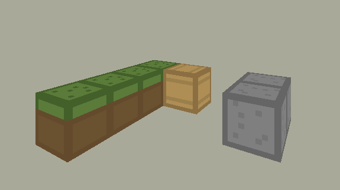

# Custom 3D Game Engine in Rust

A 3D game engine, written from scratch (**without OpenGL, Vulkan or anything else**) in Rust. The only library that I used is [pixels crate](https://docs.rs/pixels/latest/pixels/), that allows to **draw RGBA pixels on the screen**. I implemented manually all the 3D-to-2D algorithms and optimized polygon operations to be able to render a realistic world.

It features:
* 3D to 2D projections: to represent a 3D world as a 2D buffer of pixels, through a realistic **camera model**.
* Different rendering algorithm have been implementing: 
  * A basic **raytracing**: this was my first POC, it's slow (1000 polygons render at ~5 FPS)
  * A more complex one: the **Painter algorithm** : 1000 polygons are rendered at 60 FPS ! 
* In my quest of optimizing, I implemented a **Binary-Space-Partitioning** representation of the space, to make the painter algorithm about twice faster.
* **Textures** rendering are also implemented. User-defines textures are loaded when opening the world and used as static variables elsewhere in the code.
* User motions in the 3D world

```terminal
cargo run --release
```

Here's a small example with a few hundreds polygon displayed.


And here's an example of **texture rendering** 


Using textures, it gets easy to "tune" your own world. For instance, I was able to render minecraft like cubes, as seen here.



Such kind of world is created with a quick API. For instance, you'd use the following three lines to create 3 blocks:

```rust
world.add_cube(Cube3::minecraft_like(Vector3::newi(0,0,0), soil_side, soil_top));
world.add_cube(Cube3::minecraft_like(Vector3::newi(0,-1,0), wood, wood));
world.add_cube(Cube3::minecraft_like(Vector3::newi(1,-3,0), stone, stone));
```

The **BSP polygon splitting** that occurs during the construction of the BSP plane allows to create more complex shapes with occlusion. For instance, adding a continuous floor.


**Why have I done this ?**

I wanted to learn more about **computer graphics**, algorithmic in general, in software architecture and to keep progressing in Rust. 

As a matter of fact, writing your own game engine involves *a lot* of design questions, of algorithms implementation and of writing somewhat optimal code.

**What was my goal ?**

This seems to be one of my biggest personal project, I'd love to keep expanding it to an actual playable game. 

I would like to implement a small game, either a version of Doom, or a minimal version of Minecraft.

**How to change screen resolution ?**

Change the global constants `WIDTH` and `HEIGHT` in `main.rs`.

**How to change the camera model ?**

In the file `camera.rs`, you can change the `::default()` constructor to change the camera's **focal distance** or its **optical center**.

# Personal TODO-list

Last steps to have a something more usable (if I ever find the time to !)

- obstacle detection: block motion when hitting a face
- format to load a map 

# Notes

## Project a 3D world into a camera

### What is a camera?

A basic camera model consists of

* Projective transformation is any mapping of points that preserves straight lines
* A camera is a mapping between the 3D world (image space) and a 2D image: a matrix

### Projection from world coordinate to camera coordinates

Let a point $x = [x,y,z]$ expressed in the world coordinate. The homogenous transformation $T$ such that the same point is expressed in camera coordinates $X = [X,Y,Z]$ is given by $X' = T x'$ (where $x'$ denotes the homogeneous coordinates), and $T = [R, t]$.

To express the rotation matrix $R$, one can simply write $R = [r1, r2, r3]$ where $r_i$ is the world's i-th axis expressed in camera coordinates.
